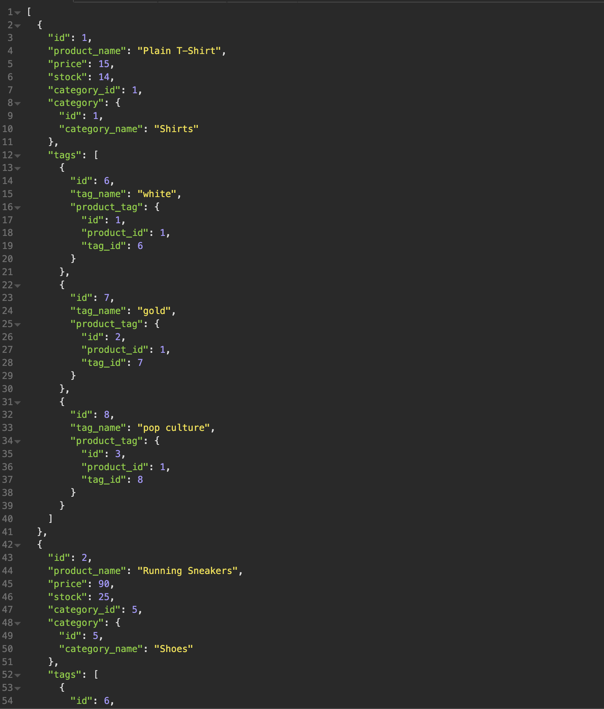

# Random Shirt: An E-Commerce Back End

## Description

The Random Shirt Application is designed to model an e-commerce store. The application uses a restful API design 
to handle GET, POST, PUT, and DELETE requests to various routes. You can view categories, tags, and products by
starting up the applicaations server and making queries through insomnia.

## Table of Contents 

- [Installation](#Installation)
- [Usage](#Usage)
- [Credits](#Credits)
- [License](#License)

## Installation

Installation instructions: `npm i`   
Log in to MySQL and in MySQL CLI: run `SOURCE db/schema.sql`  
Log out of MySQL and in the CLI: run `npm run seed`  
Convert the .env.EXAMPLE to a regular .env file in the root directory with 
three variables with your respective credentials:
(DB_NAME is already defined for you for in the example file)
`DB_NAME='database name'` `DB_USER='user name'` `DB_PASSWORD='SQL password'`  

## Usage
After the installation instructions have been completed you can start the application by running `npm start`, or if you would like to make changes
to the application and not have to restart the server every time a change is made run `npm run watch`. From there, if you seeded the database you can start
making queries through insomonia to the routes in defined in the routes/api directory.

Format for POST/PUT query:

- Category
```
{
    "category_name": "NameOfCategory"
}
```

- Product
```
{
    "product_name": "Basketball",
    "price": 200.00,
    "stock": 3,
    "tagIds": [1, 2, 3, 4]
}
```

- Tag
```
{
    "tag_name": "NameOfTag"
}
```

Example Queries:

- GET all categories


- GET all products



- GET all tags


## Credits

N/A 


## License

See LICENSE above
